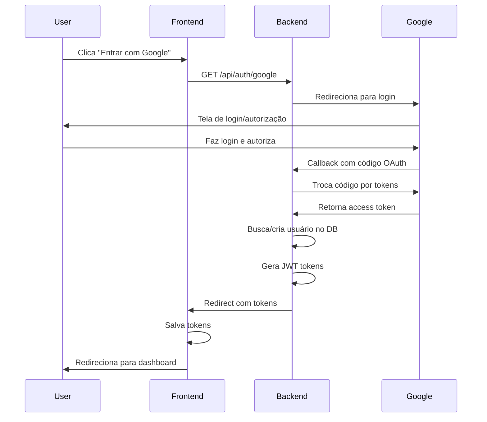

# Configuração Google OAuth 2.0

Guia completo para configurar autenticação com Google no BarberPro.

## 1. Criar Projeto no Google Cloud Console

1. Acesse [Google Cloud Console](https://console.cloud.google.com/)
2. Clique em **"Select a project"** → **"New Project"**
3. Nome do projeto: `BarberPro` (ou nome de sua preferência)
4. Clique em **"Create"**

## 2. Habilitar Google+ API

1. No menu lateral, vá em **"APIs & Services"** → **"Library"**
2. Busque por **"Google+ API"**
3. Clique em **"Enable"**

## 3. Configurar OAuth Consent Screen

1. Vá em **"APIs & Services"** → **"OAuth consent screen"**
2. Selecione **"External"** (para permitir qualquer usuário Google)
3. Clique em **"Create"**

### Preencha as informações:

**App information:**
- App name: `BarberPro`
- User support email: `seu-email@gmail.com`
- App logo: (opcional, adicione o logo do BarberPro)

**App domain:**
- Application home page: `http://localhost:3000` (dev) ou `https://seudominioprod.com` (prod)
- Application privacy policy link: `http://localhost:3000/privacy`
- Application terms of service link: `http://localhost:3000/terms`

**Authorized domains:**
- Adicione: `localhost` (dev)
- Adicione: `seudominioprod.com` (prod)

**Developer contact information:**
- Email addresses: `seu-email@gmail.com`

4. Clique em **"Save and Continue"**

### Scopes (Escopos):

1. Clique em **"Add or Remove Scopes"**
2. Selecione:
   - `userinfo.email`
   - `userinfo.profile`
   - `openid`
3. Clique em **"Update"** → **"Save and Continue"**

### Test users (modo desenvolvimento):

1. Adicione emails de teste (limite de 100 usuários em modo test)
2. Clique em **"Save and Continue"**

## 4. Criar Credenciais OAuth 2.0

1. Vá em **"APIs & Services"** → **"Credentials"**
2. Clique em **"+ Create Credentials"** → **"OAuth client ID"**

### Configure:

**Application type:** `Web application`

**Name:** `BarberPro Web Client`

**Authorized JavaScript origins:**
- `http://localhost:3000` (frontend dev)
- `http://localhost:3001` (frontend dev alternativo)
- `https://seudominioprod.com` (produção)

**Authorized redirect URIs:**
- `http://localhost:3000/api/auth/google/callback` (backend dev)
- `https://api.seudominioprod.com/api/auth/google/callback` (produção)

3. Clique em **"Create"**

## 5. Copiar Credenciais

Após criar, você verá uma modal com:
- **Client ID**: `xxxxxxxxxxxxx.apps.googleusercontent.com`
- **Client Secret**: `GOCSPX-xxxxxxxxxxxxxxxxx`

## 6. Configurar Variáveis de Ambiente

### Backend (.env)

```env
# Google OAuth
GOOGLE_CLIENT_ID="123456789012-abcdefghijklmnopqrstuvwxyz123456.apps.googleusercontent.com"
GOOGLE_CLIENT_SECRET="GOCSPX-ABCDEFGHIJKLMNOPQRSTUVWXyz"
GOOGLE_CALLBACK_URL="http://localhost:3000/api/auth/google/callback"

# Frontend URL (para redirecionamento após login)
FRONTEND_URL="http://localhost:3001"
```

### Produção

**IMPORTANTE:** Em produção, use HTTPS e domínios reais:

```env
GOOGLE_CALLBACK_URL="https://api.seudominioprod.com/api/auth/google/callback"
FRONTEND_URL="https://seudominioprod.com"
```

## 7. Testar Autenticação

### Via Navegador (fluxo completo):

1. Inicie o backend: `npm run start:dev`
2. Acesse: `http://localhost:3000/api/auth/google`
3. Será redirecionado para tela de login do Google
4. Faça login com sua conta Google
5. Após autorizar, será redirecionado para: `http://localhost:3001/auth/callback?accessToken=xxx&refreshToken=yyy`

### Via Frontend (integração PWA):

No seu aplicativo PWA/React/Next.js, adicione um botão:

```typescript
const handleGoogleLogin = () => {
  window.location.href = 'http://localhost:3000/api/auth/google';
};

<button onClick={handleGoogleLogin}>
  
  Entrar com Google
</button>
```

Capture os tokens na rota `/auth/callback`:

```typescript
// app/auth/callback/page.tsx (Next.js)
'use client';

import { useEffect } from 'react';
import { useRouter, useSearchParams } from 'next/navigation';

export default function AuthCallback() {
  const router = useRouter();
  const searchParams = useSearchParams();

  useEffect(() => {
    const accessToken = searchParams.get('accessToken');
    const refreshToken = searchParams.get('refreshToken');

    if (accessToken && refreshToken) {
      // Salvar tokens (localStorage, cookies, ou state manager)
      localStorage.setItem('accessToken', accessToken);
      localStorage.setItem('refreshToken', refreshToken);

      // Redirecionar para dashboard
      router.push('/dashboard');
    } else {
      // Erro na autenticação
      router.push('/login?error=auth_failed');
    }
  }, [searchParams, router]);

  return <div>Processando login...</div>;
}
```

## 8. Endpoints Disponíveis

### GET /api/auth/google
Inicia o fluxo OAuth com Google. Redireciona para tela de login do Google.

### GET /api/auth/google/callback
Callback do Google OAuth. Processa autenticação e redireciona para frontend com tokens.

**Response (via redirect):**
```
http://localhost:3001/auth/callback?accessToken=eyJhbGc...&refreshToken=eyJhbGc...
```

## 9. Fluxo de Autenticação



## 10. Lógica de Usuários

### Novo Usuário (primeira vez):
- Cria conta automaticamente com role `CLIENT`
- Email verificado automaticamente
- Sem vinculação a barbearia (shopId = null)
- Avatar importado do Google

### Usuário Existente (email já cadastrado):
- Se tinha login local (email/senha): migra para OAuth Google
- Mantém role e vinculações existentes
- Atualiza avatar com foto do Google

### Super Admin / Admin / Barber:
- Podem fazer login com Google se o email já estiver cadastrado
- Mantém permissões e vinculações com barbearia

## 11. Segurança

### Validações Implementadas:

✅ Tokens JWT com expiração (15min access, 7d refresh)
✅ Email verificado automaticamente pelo Google
✅ HTTPS obrigatório em produção
✅ CORS configurado para domínios autorizados
✅ Rate limiting (100 req/15min)
✅ Refresh token hasheado no banco

### Boas Práticas:

- **NUNCA** exponha `GOOGLE_CLIENT_SECRET` no frontend
- Use HTTPS em produção
- Configure domínios autorizados no Google Console
- Rotate secrets periodicamente
- Monitor logins suspeitos via Google Cloud Console

## 12. Modo Produção

### Publicar app (sair de modo "Testing"):

1. Google Cloud Console → **OAuth consent screen**
2. Clique em **"Publish App"**
3. Aguarde revisão do Google (pode levar dias)
4. App publicado permite qualquer usuário Google fazer login

### Enquanto em modo Testing:

- Limite de 100 test users
- Adicione emails manualmente em "Test users"
- Ideal para desenvolvimento e homologação

## 13. Troubleshooting

### Erro: "redirect_uri_mismatch"
**Solução:** Verifique se a URL de callback no `.env` está exatamente igual à configurada no Google Console (incluindo protocolo, porta e path).

### Erro: "access_denied"
**Solução:** Usuário cancelou autorização ou não está na lista de test users (modo Testing).

### Erro: "invalid_client"
**Solução:** `GOOGLE_CLIENT_ID` ou `GOOGLE_CLIENT_SECRET` incorretos no `.env`.

### Tokens não chegam no frontend
**Solução:** Verifique `FRONTEND_URL` no `.env` e CORS configurado em `main.ts`.

## 14. Swagger Documentation

Após configurar, teste via Swagger UI:

1. Acesse: `http://localhost:3000/api/docs`
2. Procure por endpoints `/auth/google` e `/auth/google/callback`
3. **Nota:** Para testar OAuth, use navegador direto (Swagger UI não suporta fluxo redirect)

## 15. Referências

- [Google OAuth 2.0 Documentation](https://developers.google.com/identity/protocols/oauth2)
- [Passport Google OAuth20 Strategy](http://www.passportjs.org/packages/passport-google-oauth20/)
- [NestJS Authentication](https://docs.nestjs.com/security/authentication)
