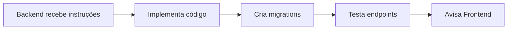
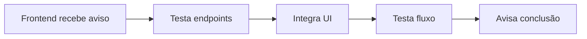
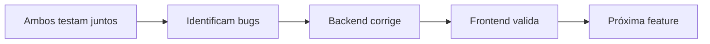

# 🤝 COORDENAÇÃO BACKEND ↔️ FRONTEND

## 📋 CONTEXTO
Sistema BarberPro está sendo desenvolvido por **duas IAs trabalhando em paralelo**:
- 🔧 **IA Backend**: Implementa API (NestJS + PostgreSQL)
- 🎨 **IA Frontend**: Implementa UI (React + TypeScript)

**Prazo:** Lançar MVP em **1 semana** (até 20/02/2026)

---

## 🎯 TAREFA DE HOJE (13/02) - 2 HORAS

### Backend (1h30min)
✅ Criar módulo completo de Appointments  
📄 Instruções: `BACKEND_INSTRUCTIONS_TODAY.md`

### Frontend (30min)
✅ Atualizar appointmentService e criar hooks  
📄 Status: `FRONTEND_STATUS_TODAY.md`

---

## 📡 PROTOCOLO DE COMUNICAÇÃO

### 1️⃣ Backend terminou tarefa
**Enviar mensagem:**
```
✅ BACKEND PRONTO - Appointments API

Endpoints criados:
• POST /appointments - Criar agendamento
• GET /appointments - Listar (filtros disponíveis)
• GET /appointments/:id - Buscar por ID
• PATCH /appointments/:id - Atualizar
• DELETE /appointments/:id - Cancelar

Response structure:
{
  "id": "uuid",
  "scheduledAt": "2026-02-14T10:00:00.000Z",
  "duration": 60,
  "status": "SCHEDULED",
  "paymentStatus": "PENDING",
  "totalPrice": 50.00,
  "client": { "id": "uuid", "name": "string", "email": "string" },
  "barber": { "id": "uuid", "name": "string" },
  "barbershop": { "id": "uuid", "name": "string" },
  "services": [
    { "id": "uuid", "name": "string", "price": 50.00, "duration": 60 }
  ]
}

Status codes:
• 201 - Created
• 200 - Success
• 400 - Bad Request (conflito de horário, validação)
• 404 - Not Found
• 401 - Unauthorized

Validações implementadas:
✅ Conflito de horário
✅ Cálculo automático de preço
✅ Multi-tenant
✅ Soft delete (status CANCELLED)

Backend rodando em: http://localhost:3000
Testado com: Postman ✅
```

### 2️⃣ Frontend terminou integração
**Enviar mensagem:**
```
✅ FRONTEND INTEGRADO - Appointments

Implementado:
• appointmentService.ts - CRUD completo
• useAppointments() hooks - Estado reativo
• Booking.tsx - Criar agendamento
• ClientDashboard.tsx - Ver agendamentos
• BarberDashboard.tsx - Gerenciar agenda

Testado:
✅ Criar agendamento funciona
✅ Listar agendamentos funciona
✅ Atualizar status funciona
✅ Cancelar funciona
✅ Loading states ok
✅ Error handling ok

Próximo passo: [especificar]
```

---

## 🔄 FLUXO DE TRABALHO

### Fase 1: Backend desenvolve API (HOJE)


### Fase 2: Frontend integra (AMANHÃ)


### Fase 3: Testes integrados


---

## 📝 CHECKLIST DE SINCRONIZAÇÃO

### Antes de começar nova feature
- [ ] Backend e Frontend alinhados no que vai ser feito?
- [ ] Contrato (request/response) está definido?
- [ ] Ambos sabem as dependencies?

### Durante desenvolvimento
- [ ] Backend avisa quando criar novo endpoint?
- [ ] Frontend testa endpoint antes de integrar?
- [ ] Problemas são comunicados imediatamente?

### Após conclusão
- [ ] Backend testou todos os endpoints?
- [ ] Frontend testou integração completa?
- [ ] Ambos documentaram o que fizeram?

---

## 🛠️ FERRAMENTAS DE TESTE

### Backend testar APIs
```bash
# Usando curl
curl -X POST http://localhost:3000/appointments \
  -H "Authorization: Bearer $TOKEN" \
  -H "Content-Type: application/json" \
  -d '{"scheduledAt":"2026-02-14T10:00:00Z","duration":60,...}'

# Ou usar Postman / Insomnia
```

### Frontend testar integração
```typescript
// Console do navegador
import { appointmentService } from './services';

// Testar criar
await appointmentService.create({...});

// Testar listar
await appointmentService.list({ barberId: '...' });
```

---

## 🚨 QUANDO DER PROBLEMA

### Backend encontra erro
**Avisar Frontend:**
```
⚠️ PROBLEMA - Appointments API

Endpoint: POST /appointments
Erro: Conflito de horário não está validando corretamente
Status: Investigando
ETA: 20 minutos

Frontend: Pode continuar outras tarefas, aviso quando resolver
```

### Frontend encontra erro
**Avisar Backend:**
```
⚠️ PROBLEMA - Integração Appointments

Endpoint: GET /appointments
Erro: Response não inclui campo 'services'
Esperado: { services: [...] }
Recebido: { services: null }

Backend: Pode verificar o eager loading?
```

---

## 📅 ROADMAP SINCRONIZADO

### HOJE (13/02) - Dia 1
- **Backend**: Criar API Appointments ⏳
- **Frontend**: Atualizar services/hooks ✅

### AMANHÃ (14/02) - Dia 2
- **Backend**: Testes + endpoints extras
- **Frontend**: Integrar Booking + Dashboards

### 15/02 - Dia 3
- **Backend**: Integração Caixa (link appointments→sales)
- **Frontend**: Tela Caixa com appointments pendentes

### 16/02 - Dia 4
- **Backend**: Ordem de Serviço API
- **Frontend**: Componente Ordem de Serviço

### 17/02 - Dia 5
- **Ambos**: Refinamentos e validações

### 18/02 - Dia 6
- **Ambos**: Testes end-to-end

### 19/02 - Dia 7
- **Ambos**: Deploy produção

---

## 📊 MÉTRICAS DE PROGRESSO

### Como medir progresso
- [ ] Endpoints implementados / Total de endpoints
- [ ] Telas integradas / Total de telas
- [ ] Fluxos funcionando end-to-end
- [ ] Bugs encontrados e resolvidos

### Status Atual (13/02 - 18:00)
```
Backend Appointments API: 🟡 Em desenvolvimento (70%)
Frontend Integration:     🟢 Base pronta (100%)
Testes Integrados:        🔴 Aguardando backend (0%)
```

---

## 🎯 DEFINIÇÃO DE "PRONTO"

### Backend está pronto quando:
- [x] Código implementado sem erros
- [x] Migration rodou com sucesso
- [x] Tabelas criadas no banco
- [x] Endpoints testados (Postman)
- [x] Response structure documentada
- [x] Frontend avisado

### Frontend está pronto quando:
- [ ] Service integrado com API
- [ ] Hooks criados
- [ ] UI implementada
- [ ] Loading states funcionando
- [ ] Error handling implementado
- [ ] Testado no navegador
- [ ] Backend avisado

### Feature está completa quando:
- [ ] Backend pronto ✅
- [ ] Frontend pronto ✅
- [ ] Teste end-to-end passou ✅
- [ ] Documentação atualizada ✅
- [ ] Bugs conhecidos resolvidos ✅

---

## 💡 DICAS DE COLABORAÇÃO

### Para Backend
1. **Sempre documente response structure**
   ```typescript
   // Bom ✅
   Response: { id: string, name: string, ... }
   
   // Ruim ❌
   "Retorna um objeto"
   ```

2. **Avisar sobre breaking changes**
   ```
   ⚠️ BREAKING CHANGE
   Campo 'date' renomeado para 'scheduledAt'
   Frontend precisa atualizar
   ```

3. **Incluir exemplos de uso**
   ```json
   POST /appointments
   {
     "scheduledAt": "2026-02-14T10:00:00Z",
     "duration": 60,
     ...
   }
   ```

### Para Frontend
1. **Testar endpoints primeiro**
   Antes de integrar na UI, testar no console/Postman

2. **Avisar sobre necessidades específicas**
   ```
   📣 NECESSIDADE
   Endpoint: GET /appointments/barber/:id/summary
   Retornar: total de atendimentos, valor total, comissão
   Prioridade: Média
   ```

3. **Validar assumptions**
   ```
   ❓ DÚVIDA
   Campo 'paymentStatus' é obrigatório?
   Pode ser null quando status != COMPLETED?
   ```

---

## 📞 CANAIS DE COMUNICAÇÃO

### Documentos compartilhados
1. `ACTION_PLAN_1_WEEK_MVP.md` - Roadmap geral
2. `BACKEND_INSTRUCTIONS_TODAY.md` - Tarefas backend
3. `FRONTEND_STATUS_TODAY.md` - Status frontend
4. `COORDINATION.md` - Este arquivo

### Como usar
- **Backend**: Leia `BACKEND_INSTRUCTIONS_TODAY.md`
- **Frontend**: Leia `FRONTEND_STATUS_TODAY.md`
- **Ambos**: Atualizem este `COORDINATION.md` com status

---

## ✅ TEMPLATE DE STATUS UPDATE

### Diário (fim do dia)
```markdown
## STATUS - DD/MM

### Backend
- ✅ Concluído: [lista]
- ⏳ Em andamento: [lista]
- 🔴 Bloqueado: [lista + motivo]

### Frontend
- ✅ Concluído: [lista]
- ⏳ Em andamento: [lista]
- 🔴 Bloqueado: [lista + motivo]

### Próximo dia
- Backend: [prioridades]
- Frontend: [prioridades]
```

---

## 🎉 VAMOS FAZER ACONTECER!

**Lembre-se:**
- ✅ Comunicação clara
- ✅ Testes frequentes
- ✅ Integração contínua
- ✅ MVP funcional em 7 dias

**Foco hoje:** Criar base sólida da API de Appointments

---

**Última atualização:** 13/02/2026 - 17:50  
**Próxima sync:** Amanhã 09:00  
**Responsável:** Ambas as IAs
