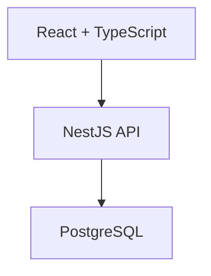
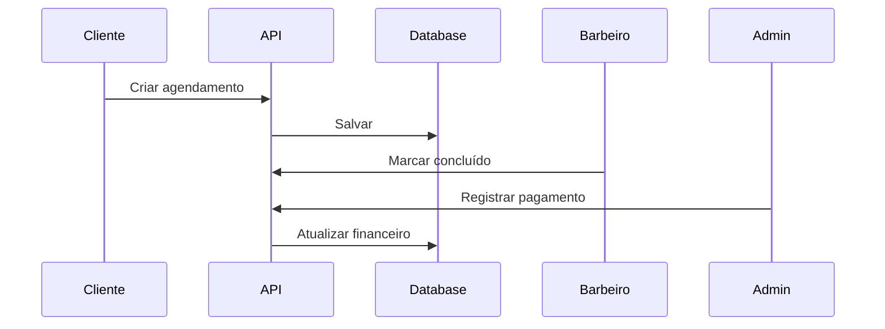

# 📊 BarberPro - Índice de Diagramas e Documentação

## 🎯 Visão Geral

Este é o **índice central** de toda a documentação visual e técnica do sistema BarberPro.

---

## 📐 Diagramas do Sistema

### 1. 🏗️ Arquitetura Geral
**Mostra**: Frontend, Backend, Database e todas as integrações  
**Formato**: Flowchart  
**Onde ver**: Dentro de [MVP_ROADMAP_COMPLETE.md](./MVP_ROADMAP_COMPLETE.md)  
**Status**: ✅ Documentado



**Componentes Destacados**:
- 🟡 Amarelo: Funcionalidades críticas para MVP
- 🔴 Vermelho: APIs que precisam implementação urgente

---

### 2. 🔄 Fluxo de Agendamento End-to-End
**Mostra**: Cliente agenda → Barbeiro atende → Admin registra pagamento → Sistema atualiza financeiro  
**Formato**: Sequence Diagram  
**Onde ver**: Dentro de [MVP_ROADMAP_COMPLETE.md](./MVP_ROADMAP_COMPLETE.md)  
**Status**: ⚠️ Fluxo documentado, mas não implementado



**Pontos Críticos**:
- ❌ API de Appointments não existe
- ❌ Integração Agenda → Caixa faltando
- ❌ Dashboard Barbeiro sem dados reais

---

### 3. 🗄️ Modelo de Dados Completo
**Mostra**: Todas as tabelas e relacionamentos  
**Formato**: Entity Relationship Diagram  
**Onde ver**: Dentro de [SHOP_SWITCHING_PERMISSIONS.md](./SHOP_SWITCHING_PERMISSIONS.md)  
**Status**: ✅ Estrutura definida

**Tabelas Principais**:
- 👤 `users` - Usuários do sistema
- 🏪 `barbershops` - Barbearias/unidades
- 👥 `team_members` - Barbeiros/colaboradores
- ✂️ `services` - Serviços oferecidos
- 🛍️ `products` - Produtos para venda
- 📅 `appointments` - ⚠️ **PRECISA CRIAR**
- 💵 `sales` - Vendas registradas
- 📄 `invoices` - Notas fiscais

---

### 4. 📅 Cronograma de Desenvolvimento
**Mostra**: Timeline de sprints e entregas  
**Formato**: Gantt Chart  
**Onde ver**: Dentro de [MVP_ROADMAP_COMPLETE.md](./MVP_ROADMAP_COMPLETE.md)  
**Status**: ✅ Planejado

**Sprints**:
- 🔴 **Sprint 1**: 10-12 dias - API Appointments + Dashboards
- 🟡 **Sprint 2**: 7 dias - Integração Caixa + Ordem Serviço
- 🟢 **Sprint 3**: Opcional - Notificações + Avaliações

---

### 5. 🧠 Mindmap de Funcionalidades
**Mostra**: Status de implementação de cada módulo  
**Formato**: Mindmap  
**Onde ver**: Acima neste documento  
**Status**: ✅ Atualizado

**Legenda**:
- ✅ Implementado
- ⚠️ Parcialmente implementado
- ❌ Não implementado

---

### 6. 🚶 Jornada do Cliente
**Mostra**: Experiência do cliente do início ao fim  
**Formato**: Journey Map  
**Onde ver**: Acima neste documento  
**Status**: ✅ Mapeado

**Etapas**:
1. Descoberta → 2. Agendamento → 3. Lembretes → 4. Atendimento → 5. Pagamento → 6. Avaliação

---

### 7. 🔀 Fluxo de Troca de Barbearias
**Mostra**: Como usuários trocam entre unidades  
**Formato**: Decision Tree  
**Onde ver**: [SHOP_SWITCHING_IMPLEMENTATION_SUMMARY.md](./SHOP_SWITCHING_IMPLEMENTATION_SUMMARY.md)  
**Status**: ✅ Implementado no frontend

---

## 📚 Documentação Técnica

### 📖 Guias Completos

| Documento | Propósito | Status |
|-----------|-----------|--------|
| [MVP_ROADMAP_COMPLETE.md](./MVP_ROADMAP_COMPLETE.md) | Análise completa e roadmap | ✅ Completo |
| [SYSTEM_ANALYSIS_COMPLETE.md](./SYSTEM_ANALYSIS_COMPLETE.md) | Análise visual com código | ✅ Completo |
| [SHOP_SWITCHING_PERMISSIONS.md](./SHOP_SWITCHING_PERMISSIONS.md) | Sistema de troca de unidades | ✅ Completo |
| [BACKEND_INTEGRATION_COMPLETE.md](./BACKEND_INTEGRATION_COMPLETE.md) | Integração backend documentada | ✅ Completo |
| [FINANCIAL_SYSTEM_DOCUMENTATION.md](./FINANCIAL_SYSTEM_DOCUMENTATION.md) | Sistema financeiro | ✅ Completo |

### 🎨 Guias de UI/UX

| Documento | Propósito | Status |
|-----------|-----------|--------|
| [STYLE_GUIDE.md](./STYLE_GUIDE.md) | Guia de estilos visuais | ✅ Completo |
| [VISUAL_GUIDE.md](./VISUAL_GUIDE.md) | Componentes visuais | ✅ Completo |
| [STYLE_PATTERNS_GUIDE.md](./STYLE_PATTERNS_GUIDE.md) | Padrões de design | ✅ Completo |

### 🧪 Guias de Testes

| Documento | Propósito | Status |
|-----------|-----------|--------|
| [TESTING_GUIDE.md](./TESTING_GUIDE.md) | Como testar o sistema | ✅ Completo |
| [QA_FINANCIAL_INTEGRATION.md](./QA_FINANCIAL_INTEGRATION.md) | QA do financeiro | ✅ Completo |
| [SMOKE_TEST_FINANCIAL.md](./SMOKE_TEST_FINANCIAL.md) | Testes de fumaça | ✅ Completo |

---

## 🎯 Status Atual do Projeto

### ✅ O que está pronto (60%)

```
✅ Autenticação completa (JWT + Refresh)
✅ Multi-tenant funcionando
✅ CRUD de Barbearias
✅ CRUD de Equipe (Team)
✅ CRUD de Serviços
✅ CRUD de Produtos + Estoque
✅ CRUD de Planos
✅ Dashboard Financeiro (Analytics)
✅ Caixa (registrar vendas)
✅ Histórico de Vendas
✅ Notas Fiscais
✅ UI/UX responsivo + Dark mode
```

### ⚠️ O que está parcial (20%)

```
⚠️ Agendamentos (frontend existe, backend não)
⚠️ Dashboard Cliente (estrutura, sem dados)
⚠️ Dashboard Barbeiro (estrutura, sem dados)
⚠️ Troca de unidades (frontend ok, backend pendente)
⚠️ Integração Agenda → Caixa (não conectado)
```

### ❌ O que falta (20%)

```
❌ API de Appointments completa
❌ Dashboard Cliente funcional
❌ Dashboard Barbeiro funcional
❌ Ordem de Serviço
❌ Notificações (Email/SMS)
❌ Sistema de Avaliações
```

---

## 🚀 Como Usar Este Índice

### Para Desenvolvedores

1. **Começando um sprint?**
   - Consulte [MVP_ROADMAP_COMPLETE.md](./MVP_ROADMAP_COMPLETE.md) para ver tarefas
   - Veja o cronograma Gantt para timeline

2. **Implementando uma feature?**
   - Veja o fluxo sequencial da funcionalidade
   - Consulte o modelo de dados (ER Diagram)
   - Veja código de exemplo em [SYSTEM_ANALYSIS_COMPLETE.md](./SYSTEM_ANALYSIS_COMPLETE.md)

3. **Corrigindo bugs?**
   - Veja o fluxo completo para entender onde está o problema
   - Consulte o mindmap para ver status de dependências

### Para Product Owners

1. **Planejando release?**
   - Veja o checklist de MVP em [MVP_ROADMAP_COMPLETE.md](./MVP_ROADMAP_COMPLETE.md)
   - Consulte cronograma Gantt para estimativas

2. **Entendendo a experiência do usuário?**
   - Veja a Journey Map do cliente
   - Consulte os fluxos de cada funcionalidade

3. **Priorizando features?**
   - Veja o mindmap de status
   - Consulte lista de funcionalidades críticas

### Para QA/Testers

1. **Criando casos de teste?**
   - Veja o fluxo end-to-end de cada funcionalidade
   - Consulte [TESTING_GUIDE.md](./TESTING_GUIDE.md)

2. **Validando integração?**
   - Veja diagramas de sequência
   - Teste cada etapa do fluxo

---

## 📊 Métricas do Projeto

### Cobertura de Funcionalidades

| Módulo | Completo | Parcial | Faltante | Total |
|--------|----------|---------|----------|-------|
| Autenticação | 100% | 0% | 0% | ✅ |
| Gestão (CRUD) | 90% | 10% | 0% | ✅ |
| Agendamentos | 20% | 30% | 50% | ❌ |
| Financeiro | 80% | 15% | 5% | ⚠️ |
| UI/UX | 95% | 5% | 0% | ✅ |

### Estimativa de Conclusão

```
Timeline: ~4 semanas
Sprint 1: 10-12 dias (CRÍTICO)
Sprint 2: 7 dias (IMPORTANTE)
Sprint 3: 5-7 dias (OPCIONAL)
Testes: 2 dias
Deploy: 3 dias
```

---

## 🎯 Próximos Passos

### Hoje/Esta Semana

1. ✅ Revisar todos os diagramas
2. ✅ Entender fluxo de agendamentos
3. ⏳ Criar branch `feature/mvp-appointments`
4. ⏳ Iniciar Backend - Appointments Module

### Próxima Semana

1. ⏳ Implementar API completa
2. ⏳ Integrar frontend
3. ⏳ Criar dashboards funcionais

### Próximos 15 dias

1. ⏳ Sprint 1 completo
2. ⏳ Iniciar Sprint 2
3. ⏳ Testes end-to-end

---

## 📞 Precisa de Ajuda?

### Onde encontrar informações

| Dúvida sobre... | Consulte |
|-----------------|----------|
| Arquitetura geral | Este índice + diagramas |
| Backend API | [BACKEND_INTEGRATION_COMPLETE.md](./BACKEND_INTEGRATION_COMPLETE.md) |
| Database | Modelo ER em [SHOP_SWITCHING_PERMISSIONS.md](./SHOP_SWITCHING_PERMISSIONS.md) |
| Frontend Components | [STYLE_GUIDE.md](./STYLE_GUIDE.md) |
| Fluxos de negócio | Diagramas de sequência |
| Roadmap | [MVP_ROADMAP_COMPLETE.md](./MVP_ROADMAP_COMPLETE.md) |

---

## 🎉 Conclusão

**O sistema BarberPro está 60% completo!**

Os diagramas e documentação criados fornecem um mapa completo para:
- ✅ Entender o que existe
- ✅ Identificar o que falta
- ✅ Planejar implementação
- ✅ Estimar prazos
- ✅ Testar funcionalidades

**Foco agora**: Sprint 1 - Sistema de Agendamentos

---

**Última atualização**: 13 de fevereiro de 2026  
**Versão**: 1.0  
**Autor**: Time BarberPro  
**Status**: 📊 Documentação completa - Pronto para desenvolvimento
